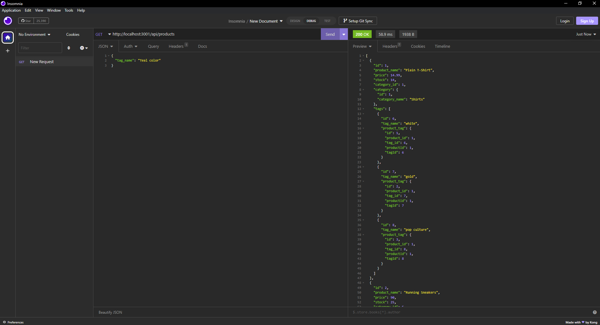

# ORM-challenge
Module 13 challenge

## About this app

* This app utilizes express and mySQL to simulate a backend for a website.
* This app features GET, POST, PUT, and DELETE routes using async and await.
* gitignore file is used to hide our database credentials.
* Use npm i to install dependencies
* Create your database by logging into mySQL
* seed your data base by running npm run seed

## Links
* Git: https://github.com/IRiceKrispie/ORM-challenge
* Video: https://www.youtube.com/watch?v=nOUxDXmZnKk

## ScreenShots

